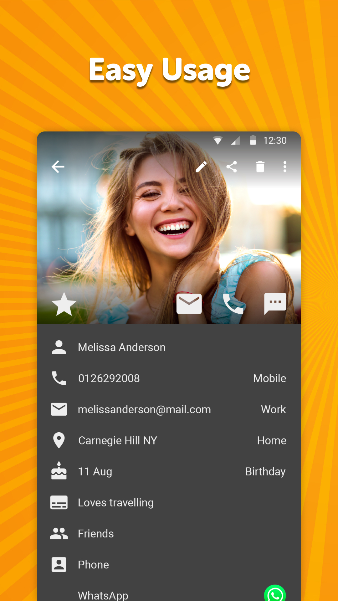
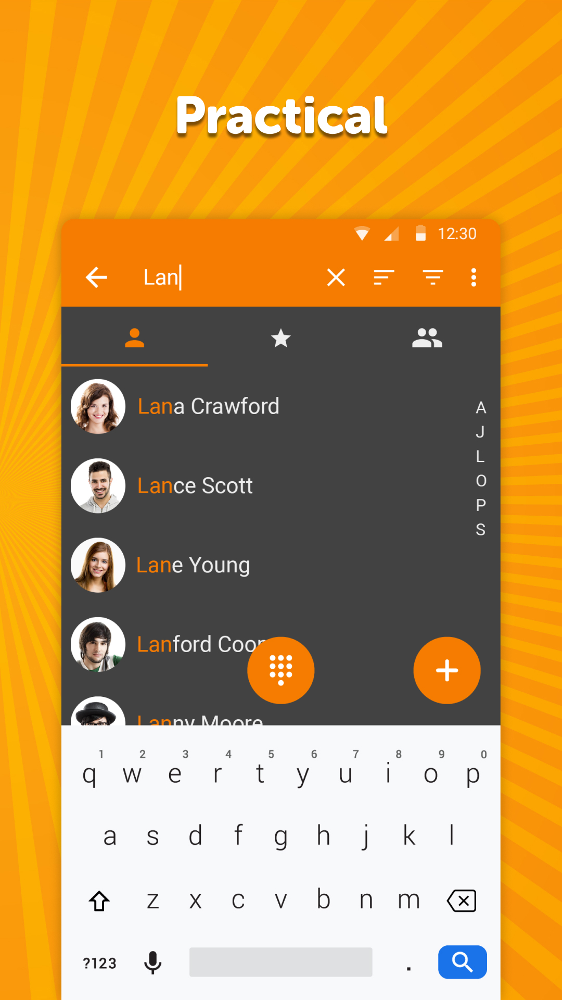

# Simple Contacts

A lightweight app for managing your contacts loved by millions of people. The contacts can be stored on your device only, but also synchronized via Google, or other accounts.

You can use it for managing user emails and events too. It has the ability to sort/filter by multiple parameters, optionally display surname as the first name.

You can display your favorite contacts or groups on a separate list. Groups can be used for sending out batch emails or SMS, to save you some time, you can rename them easily.

It contains handy buttons for calling, or texting your contacts. All visible fields can be customized as you wish, you can easily hide the unused ones. The search function will search the given string at every visible contact field, to make you find your desired contact easily.

There is a lightweight dialpad at your service too, with smart contact suggestions.

It supports exporting/importing contacts in vCard format to .vcf files, for easy migrations or backing up your data.

With this modern and stable contacts manager you can protect your contacts by not sharing them with other apps, so you can keep your contacts private.

Like the contact source, you can also easily change the contact name, email, phone number, address, organization, groups and many other customizable fields. You can use it for storing contact events too, like birthdays, anniversaries, or any other custom ones.

This simple contact editor has many handy settings like showing phone numbers on the main screen, toggle contact thumbnail visibility, showing only contacts with phone numbers, showing a call confirmation dialog before initiating a call. It comes with a quick dialer that also makes use of letters.

To further improve the user experience, you can customize what happens at clicking on a contact. You can either initiate a call, go to the View Details screen, or edit the selected contact.

You can easily block phone numbers to avoid unwanted incoming calls.

To avoid showing potentially unwanted contacts, it has a powerful built in duplicate contact merger.

It comes with material design and dark theme by default, provides great user experience for easy usage. The lack of internet access gives you more privacy, security and stability than other apps.

Contains no ads or unnecessary permissions. It is fully opensource, provides customizable colors.

Check out the full suite of Simple Tools here:  
https://www.simplemobiletools.com

Standalone website of Simple Contacts Pro:  
https://www.simplemobiletools.com/contacts

Facebook:  
https://www.facebook.com/simplemobiletools

Reddit:  
https://www.reddit.com/r/SimpleMobileTools

