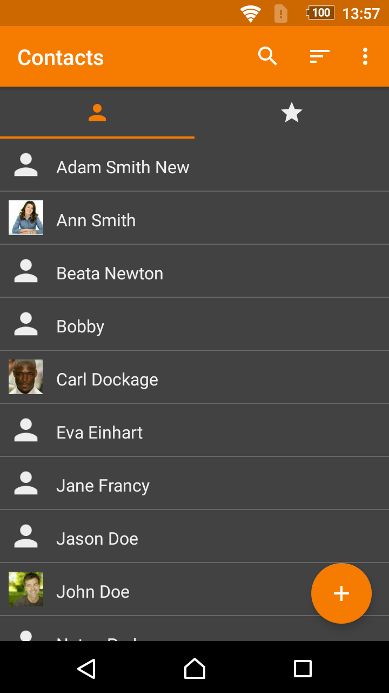
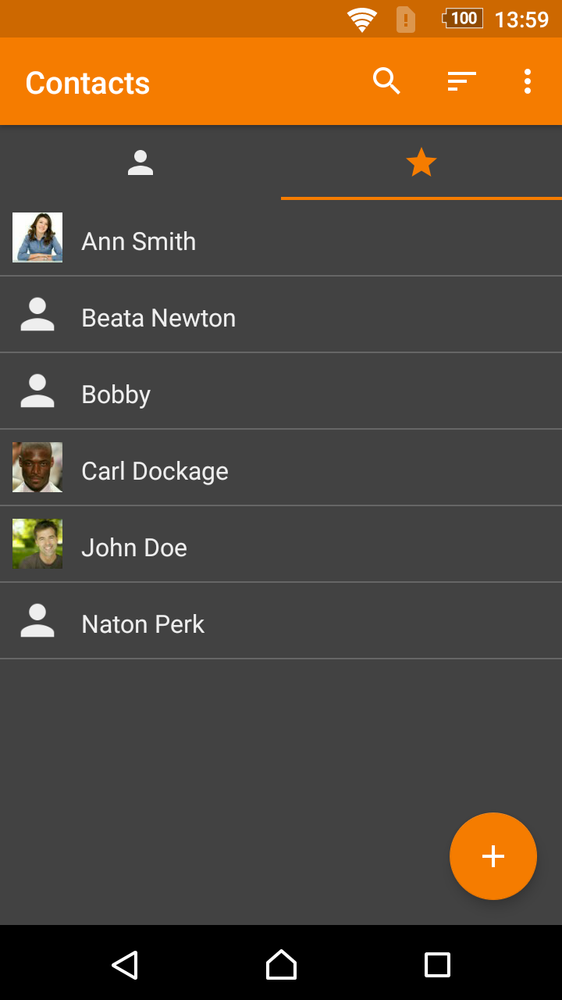
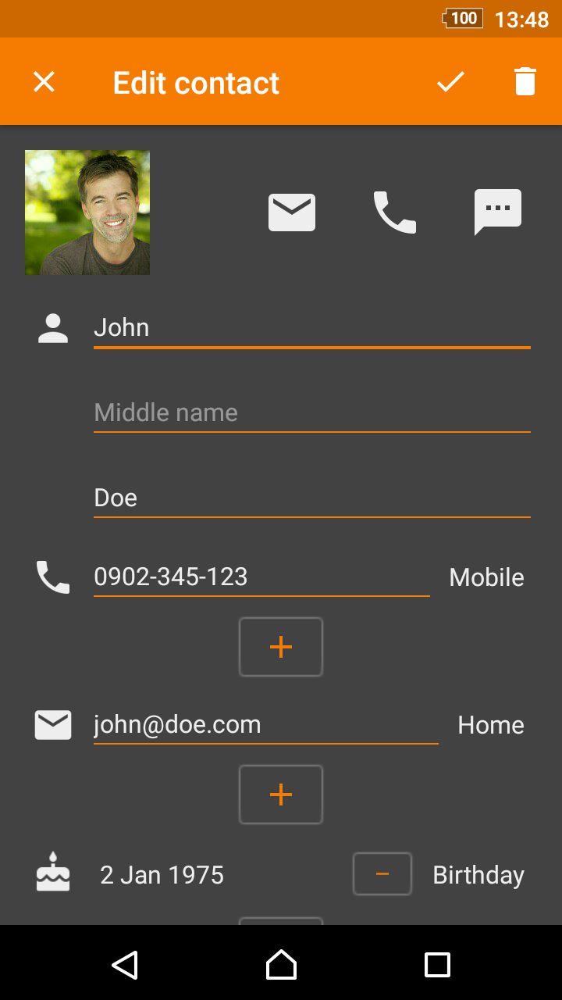

# Simple Contacts

A simple app for creating or managing your contacts from any source. The contacts can be stored on your device only, but also synchronized via Google, or other accounts. You can display your favorite contacts on a separate list.

You can use it for managing user emails and events too. It has the ability to sort/filter by multiple parameters, optionally display surname as the first name.

Contains no ads or unnecessary permissions. It is fully opensource, provides customizable colors.

This app is just one piece of a bigger series of apps. You can find the rest of them at http://www.simplemobiletools.com

License
-------
    Copyright 2017-present SimpleMobileTools
    
    Licensed under the Apache License, Version 2.0 (the "License");
    you may not use this file except in compliance with the License.
    You may obtain a copy of the License at
    
       https://www.apache.org/licenses/LICENSE-2.0
    
    Unless required by applicable law or agreed to in writing, software
    distributed under the License is distributed on an "AS IS" BASIS,
    WITHOUT WARRANTIES OR CONDITIONS OF ANY KIND, either express or implied.
    See the License for the specific language governing permissions and
    limitations under the License.
