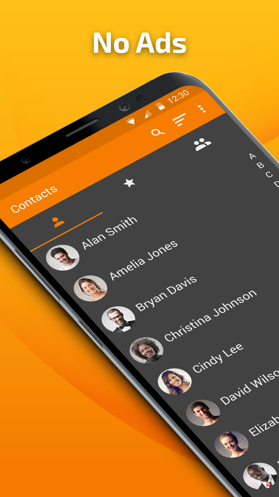
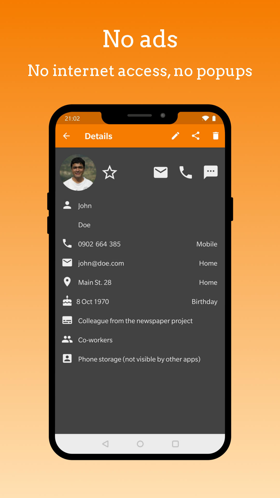
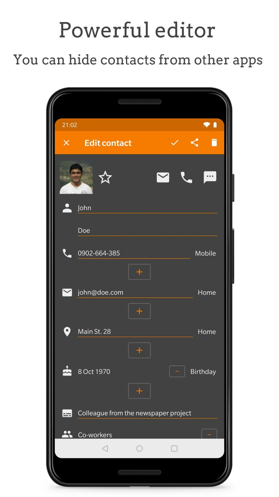

# Simple Contacts

A simple app for creating or managing your contacts from any source. The contacts can be stored on your device only, but also synchronized via Google, or other accounts. You can display your favorite contacts on a separate list.

You can use it for managing user emails and events too. It has the ability to sort/filter by multiple parameters, optionally display surname as the first name.

Contains no ads or unnecessary permissions. It is fully opensource, provides customizable colors.

This app is just one piece of a bigger series of apps. You can find the rest of them at https://www.simplemobiletools.com

