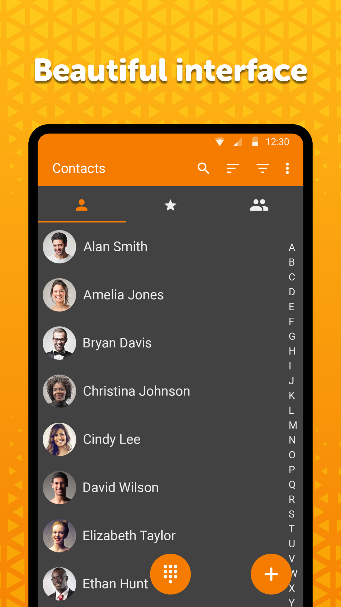

# Simple Contacts

A lightweight smart contact app for managing your contacts loved by millions of people. The contacts can either be stored on your device only, or they can also be synchronized by different means. This phone number smart contact phone book will help you keeping your contacts in one place without the hassle of backing up your contacts as the contacts backup are always in sync with the contacts you add. This app light on space and is effective when you have to make contacts backup and keep a phone book that will help you in smart contact keeping.

You can use it for managing user emails and events too. It has the ability to sort/filter by multiple parameters, optionally display surname as the first name. This way, you can achieve the smart contact retrieval in a quick way. You don't have to scroll down to find your required contact. Moreover, whenever you add a new contact, the contacts backup automatically ensuring the integrity of contacts. 

You can display your favorite people or groups on a separate list. Groups can be used for sending out batch emails or SMS, to save you some time, you can rename them easily. You don't have to keep a phone book now! Just make a smart contact group and send messages to your loved ones.

It contains handy buttons for calling, or texting your relatives. All visible fields can be customized as you wish, you can easily hide the unused ones. The search function will search the given string at every visible persons field, to make you find your desired one easily.

It supports exporting/importing contacts in vCard format to .vcf files, for easy migrations or backing up your data. Contacts backup is a crucial thing in phone book keeping. This app comes with a smart contacts backup technology that sync the new and old contacts regularly to keep a backup of these numbers.

With this modern and stable phone number manager you can protect them by not sharing them with other apps, so you can keep them private.

Like the contact source, you can also easily change their name, email, phone number, address, organization, groups and many other customizable fields. You can use it for storing contact events too, like birthdays, anniversaries, or any other custom ones.

This simple contact editor has many handy settings like showing phone numbers on the main screen, toggle contact thumbnail visibility, showing only contacts with phone numbers, showing a call confirmation dialog before initiating a call. It comes with a quick dialer that also makes use of letters.

To further improve the user experience, you can customize what happens at clicking on a contact. You can either initiate a call, go to the View Details screen, or edit the selected one.

To avoid showing potentially unwanted contacts, it has a powerful built in duplicate entry merger.

It comes with material design and dark theme by default, provides great user experience for easy usage. The lack of internet access gives you more privacy, security and stability than other apps.

Contains no ads or unnecessary permissions. It is fully open camera source, provides customizable colors.

<a href="https://f-droid.org/packages/com.simplemobiletools.contacts.pro">Get it on F-Droid</a>

Support us:  
IBAN: SK4083300000002000965231  
Bitcoin: 19Hc8A7sWGud8sP19VXDC5a5j28UyJfpyJ  
Ethereum: 0xB7a2DD6f2408Bce77334655CF5E7639aE31feb30  
Litecoin: LYACbHTKaM9ZubKQGxJ4NRyVy1gHUuztRP  
Bitcoin Cash: qz6dvmhq5vzkcsypxpp2mnur30muxdah4gvulx3y85  
Tether: 0x250f9cC32863E59b87037a14955Ed64F879653F0  
<a href="https://paypal.me/SimpleMobileTools?country.x=SK&locale.x=en_US">PayPal</a>  
<a href="https://www.patreon.com/tiborkaputa">Patreon</a>

